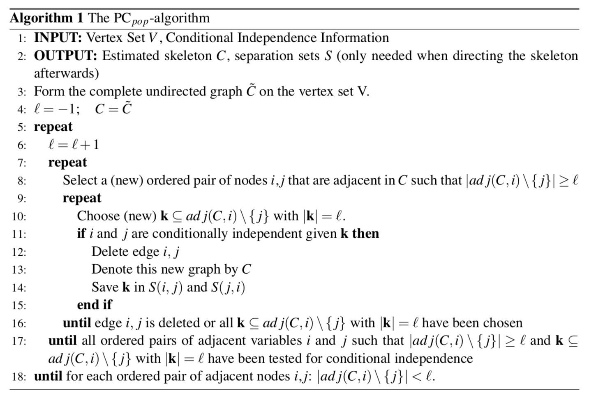
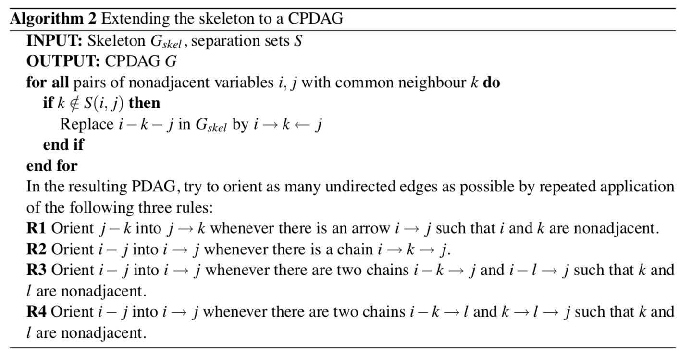

# PC 算法

## 如何使用

1. 安装依赖：

    ```bash
    pip install -r requirements.txt
    ```

2. 修改 [`data/test.csv`](data/test.csv) 中的数据

3. 运行：

    ```bash
    python run.py
    ```


&nbsp;

## 算法

### 博客

这里只是简要解释了一下 PC 算法的流程，如果想看更详细的说明（或无法加载公式），可以看我的博客：[博客](https://blog.zxh.io/post/2021/04/26/pc-algorithm/) / [知乎](https://zhuanlan.zhihu.com/p/368010458)


&nbsp;

### 依赖关系确立



图片来源：[Estimating High-Dimensional Directed Acyclic Graphs with the PC-Algorithm](http://www.jmlr.org/papers/volume8/kalisch07a/kalisch07a.pdf)

line 11: 需要条件独立关系


&nbsp;

#### 条件独立性 -> 偏相关系数

偏相关系数：校正其它变量后某一变量与另一变量的相关关系，校正的意思可以理解为假定其它变量都取值为均数。

PC 算法默认随机变量服从多元高斯分布，这时条件独立性与偏相关系数为 0 等价。

表述得更准确一点：假设随机变量 $X$ 服从多元高斯分布，对于 $i \not = j \in (1, \dots, p), k \in (1, \dots, p) \backslash \{i, j\}$，用 $\rho_{i, j \mid k}$ 表示 $X(i)$ 和 $X(j)$ 与 $X^{(r)} (r \in k)$ 之间的偏相关系数。当且仅当 $X(i)$ 和 $X(j)$ 条件独立与 $X^{(r)} (r \in k)$ 时，$\rho_{i，j \in k} = 0$。

这个结论是多元高斯分布的基本特性，证明过程可以参考 [Elements of Graphical Models](http://www.stats.ox.ac.uk/~steffen/teaching/gm10/stflournotes.pdf) 第 4.2.1 节。

所以条件独立性可由偏相关估计出来，所以条件独立性检验转偏相关系数检验。

任意两个变量 $i, j$ 的 $h$（排除其他 $h$ 个变量的影响后，$h<=k-2$）阶样本偏相关系数：

$$
\rho_{i,j \mid K} = \frac{\rho_{i,j \mid K \backslash h} - \rho_{i,h \mid K \backslash h} \rho_{j,h \mid K \backslash h}}{\sqrt{(1 - \rho^2_{i,h \mid K \backslash h}) (1 - \rho^2_{j,h \mid K \backslash h})}}
$$


&nbsp;

#### Fisher Z Test

用 Fisher Z Test 来判断 $\rho$ 是否为 0。显著性检验要求 $\rho$ 为正态分布，所以需要先将 $\rho$ 进行 Fisher's z-transformation，转换后可以认为是正态分布：

$$
Z(i, j \mid K) = \frac{1}{2} \log (\frac{1 + \hat{\rho}_{i,j \mid K}}{1 - \hat{\rho}_{i,j \mid K}})
$$

- 零假设：$H_0(i, j \mid K): \rho_{i, j \mid K} \not= 0$
- 对立假设：$H_1(i, j \mid K): \rho_{i, j \mid K} = 0$

检验规则为：当 $\sqrt{n - |K| - 3}| Z(i,j \mid K) \leq \Phi^{-1} (1 - \alpha/2)$ 时（其中 $\Phi(\cdot)$ 为 $\mathcal{N}(0, 1)$ 的累积分布函数），拒绝 $H_0$，$H_1$ 成立，$i, k$ 关于 $K$ 条件独立。

所以将上面伪代码的 line 11 替换为 $\sqrt{n - |K| - 3}| Z(i,j \mid K) \leq \Phi^{-1} (1 - \alpha/2)$。


&nbsp;

### 依赖方向确立：骨架 -> CPDAGE

依赖关系确立后，得到了一个无向图（骨架），现在需要确立依赖方向，把无向边变成有向边。



图片来源：[Estimating High-Dimensional Directed Acyclic Graphs with the PC-Algorithm](http://www.jmlr.org/papers/volume8/kalisch07a/kalisch07a.pdf)

得到一个完全部分有向无环图（CPDAG）。

可以看到 PC 算法得到的图是含有无向边的，这个图只是一个 CPDAG（依然有无向边），而不是真正意义上的贝叶斯网络（有向无环图），具体原因可以参考[我的博客](https://blog.zxh.io/post/2021/04/26/pc-algorithm/#马尔科夫等价类)。

但任意贝叶斯网络都存在唯一的 CPDAG 与之马尔科夫等价，因此，CPDAG 可以作为贝叶斯网络的表示。


&nbsp;

### 一些定义

- **部分有向无环图**（Partially Directed Acyclic Graph，PDAG）：假设 $G = (V, E)$ 是一个图，若边集 $E$ 中包含有向边和无向边，且不存在有向环，则称 $G$ 是一个部分有向无环图

- **马尔科夫等价类**（Markov Equivalence Class）：$G_1 = (V, E_1)$ 和 $G_2 = (V, E_2)$ 马尔科夫等价, 当且仅当 $G_1$ 和 $G_2$ 具有相同的骨架和 $V$ 结构

- **可逆**：

    - 有向无环图 $G = (V, E)$ ，任意有向边 $V_i \rightarrow V_j \in E$，若存在图 $G' = (V, E')$ 与 $G$ 等价，且 $V_j \rightarrow V_i \in E'$，则称有向边 $V_i \rightarrow V_j$ 在 $G$ 中是可逆的，否则是不可逆的

    - 同理, 对任意无向边 $V_i - V_j \in E​$，若存在 $G_1 = (V, E_1)​$、$G_2 = (V, E_2)​$ 均与 $G​$ 等价，且 $V_i \rightarrow V_j \in E_1​$、$V_j \rightarrow V_i \in E_2​$，则称无向边 $V_i - V_j​$ 在 $G​$ 中是可逆的，否则是不可逆的

- **完全部分有向无环图**（Completed Partially Directed Acyclic Graph，CPDAG：设 $G = (V, E)$ 是一个部分有向无环图，若 $E$ 中的有向边都是不可逆的，并且 $E$ 中的无向边都是可逆的，则称 $G$ 是一个完全部分有向无环图（CPDAG）


&nbsp;

## 参考

- [Estimating High-Dimensional Directed Acyclic Graphs with the PC-Algorithm.](http://www.jmlr.org/papers/volume8/kalisch07a/kalisch07a.pdf) *Markus Kalisch and Peter Buhlmann.* JMLR 2007.
- [An Algorithm for Fast Recovery of Sparse Causal Graphs.](http://shelf2.library.cmu.edu/Tech/28463803.pdf) *Peter Spirtes and Clark Glymour.* Social Science Computer Review 1991. 
- [d-Separation: From Theorems to Algorithms.](https://arxiv.org/pdf/1304.1505.pdf) *Dan Geiger, et al.* UAI 1989.
- [Frequency Distribution of the Values of the Correlation Coefficient in Samples from an Indefinitely Large Population.](https://www.quantresearch.org/Fisher%20transform%20seminal%20paper.pdf*) *R. A. Fisher.* Biometrika 1915.
- [Elements of Graphical Models.](http://www.stats.ox.ac.uk/~steffen/teaching/gm10/stflournotes.pdf) *Steffen L. Lauritzen.* 2011. ↩︎
- [Wikipedia: Fisher transformation](https://en.wikipedia.org/wiki/Fisher_transformation)
- R 语言实现：[pcalg: Methods for Graphical Models and Causal Inference](https://cran.r-project.org/web/packages/pcalg/)
    - `zStat(x, y, S, C)`: 计算并返回 $\sqrt{n - |K| - 3}| Z(i,j \mid K)$ 的值

    - `pcorOrder(i, j, k, C)`: 计算并返回 $i$ 和 $j$ 与 $k$ 的偏相关系数

    - `condIndFisherZ(x, y, S, C)`: 计算 $\sqrt{n - |K| - 3}| Z(i,j \mid K)$，返回它是否 <= `cutoff`

    - `gaussCItest(x, y, S, suffStat)`: 计算并返回 $\Phi^{-1} (1 - \alpha/2)$
